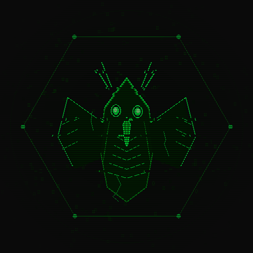

# CrackedCode: Atlantean Neural System

Local AI Coding Assistant with Sci-Fi Neural Interface

<p align="center">
  
  
  
  
  
</p>

<p align="center">
  
</p>

## Overview

CrackedCode is a **100% local AI coding assistant** featuring autonomous application production (OpenClaw-style), multi-agent orchestration, voice I/O, screen capture/vision analysis, web browser automation, security auditing, persistent long-term memory, MCP integration, A2A protocol support, and a sci-fi neural interface. No cloud, no API keys — all running locally with Ollama.

### Quick Start

```bash
# Desktop GUI (Recommended)
python src/gui.py

# CLI with code generation
python src/main.py code -p "write a function to add numbers"

# Autonomous production
python src/main.py autonomous -p "Build a todo app with web API and SQLite"

# Run tests
python test_system.py
```

### Version History

| Version | Features |
|---------|----------|
| 2.9.5 | **Complete UI Overhaul** - Redesigned left panel with tabbed workspace (FILES, AGENTS, REASONING, HISTORY), grouped toolbar (MODE, ACTION, TERMINAL, FEATURES) with labels |
| 2.9.5 | **Tab Navigation** - Scroll buttons (◀/▶), tab count badge, right-click context menu (rename, close, close others, copy path, reveal in explorer) |
| 2.9.5 | **Keyboard Shortcuts** - Ctrl+Tab/Ctrl+PgDn for next tab, Ctrl+Shift+Tab/Ctrl+PgUp for prev tab, Ctrl+W to close tab |
| 2.9.5 | **HELP/CHAT Intent Detection** - Added keyword matching for help requests and general conversation |
| 2.9.5 | **Smart Paste** - Auto-detects code snippets vs plain text on Ctrl+V; falls back to normal paste |
| 2.9.5 | **Critical Bug Fixes** - Fixed show_notification destroying UI, process_prompt variable scoping, keyPressEvent intercepting Ctrl+C/V, update_stats crash, NotificationWidget broken fade |
| 2.9.5 | **File Tree** - Increased scan limit from 100→500 with visual indicator when truncated |
| 2.9.4 | **Execution Tracer** - Capture and replay every engine call, agent decision, tool invocation with tree view |
| 2.9.4 | **Doctor / Health Check** - Automated diagnostics for all components with JSON and pretty-print output |
| 2.9.4 | **Git Pre-commit Hook** - Auto-run code review on every commit, block critical issues |
| 2.9.4 | **Memory Visualization** - Pretty-print agent profiles, patterns, and statistics in terminal |
| 2.9.4 | **Advanced Agent Memory** - Per-agent persistent memory with automatic summarization and experience learning |
| 2.9.4 | **Python SDK** - Official client with typed responses, retries, sub-clients for all API areas |
| 2.9.4 | **Benchmark Suite** - Standardized tests (HumanEval, security, refactoring) with history and trends |
| 2.9.4 | **Self-Healing Agent** - Auto-detect errors in logs, generate fixes, verify with tests |
| 2.9.0 | **Workflow Builder** - Multi-step AI automation with YAML/JSON definitions, conditions, parallel execution |
| 2.9.0 | **Agent Collaboration** - Multi-agent debate and consensus building (Parliament mode) |
| 2.9.0 | **Code Review Bot** - Automated PR/code review with 8 built-in security rules |
| 2.9.0 | **Knowledge Base / RAG Upload** - Upload PDFs, markdown, text for semantic search |
| 2.9.0 | **Model Fine-tuning Pipeline** - Local model fine-tuning with Ollama Modelfile generation |
| 2.8.2 | **Custom Tool Builder** - Define tools via JSON/YAML without Python code |
| 2.9.0 | **Multi-Model Auto-Routing** - Intent-based model selection (qwen3/dolphin/llava) |
| 2.9.0 | **Security Agent** - 11th agent role with vulnerability scanning, secret audit, permission check |
| 2.9.0 | **Browser Automation** - Playwright-based web agent with 6 tools |
| 2.9.0 | **Persistent Long-Term Memory** - Vector store of conversations, decisions, errors, fixes |
| 2.9.0 | **A2A Protocol** - Google's Agent-to-Agent protocol for multi-agent communication |
| 2.9.0 | **MCP Integration** - Model Context Protocol for external tool servers |
| 2.9.0 | **Screen Capture / Vision** - AI-powered screen understanding with llava:13b-gpu |
| 2.9.0 | **DevOps Agent** - 10th agent role with Docker, deploy, CI tools |
| 2.9.0 | **Plugin System** - Extensible hooks with hot-reload |
| 2.9.0 | **Tool Calling Framework** - ReAct loop with 36+ tools |
| 2.9.0 | **Codebase RAG** - Semantic search with local embeddings |
| 2.9.0 | **Agent Reasoning Engine** - Thought chains, coherence tracking, LLM meta-reasoning |
| 2.5.0 | UI/UX overhaul, toast notifications, searchable terminal, command palette |
| 2.4.0 | Streaming responses, response caching, context management |
| 2.3.9 | Task queue, Agent orchestration |
| 2.3.8 | Code generation pipeline, CLI CODE subcommand |

---

## Desktop GUI (v2.9.0)

```bash
python src/gui.py
```

### UI Features

- **Toast Notifications**: Non-intrusive auto-dismissing notifications
- **Command Palette**: `Ctrl+Shift+P` fuzzy-search all actions
- **Welcome Screen**: First-launch feature cards with shortcuts
- **Enhanced Status Bar**: Model, mode, file count, voice status, activity pulse
- **Searchable Terminal**: `Ctrl+F` to search terminal output
- **Command History**: Up/Down arrow navigation
- **Tab Management**: Rename tabs, modified indicators
- **Matrix Rain Toggle**: `Ctrl+M` for sci-fi effect
- **Auto-Save**: Automatic save after idle period
- **Cache Size Display**: Real-time cache monitoring

### Dockable Panels

- **Project Files**: Hierarchical navigation with auto-refresh
- **Git Panel**: Full git integration with diff viewer
- **Agent Panel**: Visual status with icons and capabilities
- **Task Queue**: Real-time task tracking
- **Reasoning Panel**: Live thought chains, coherence bar, event stream
- **Tabbed Editor**: Multiple file tabs
- **Menu Bar**: FILE/EDIT/VIEW/HELP with keyboard shortcuts

### Keyboard Shortcuts

| Shortcut | Action |
|----------|--------|
| `Ctrl+Shift+P` | Command Palette |
| `Ctrl+Shift+F` | Semantic Search |
| `Ctrl+Shift+S` | Analyze Screen (Vision) |
| `Ctrl+M` | Toggle Matrix Rain |
| `Ctrl+A` | Autonomous Production |
| `F11` | Toggle Fullscreen |
| `F12` | Dev Console |

---

## Multi-Model Auto-Routing (v2.9.0)

CrackedCode automatically routes each request to the best model based on intent:

| Intent | Model | Why |
|--------|-------|-----|
| CODE / DEBUG / BUILD / SECURITY | qwen3:8b-gpu | Reasoning, coding, planning |
| CHAT / HELP / REVIEW | dolphin-llama3:8b-gpu | Conversation, writing, creativity |
| VISION | llava:13b-gpu | Image analysis, OCR |
| BROWSE | qwen3:8b-gpu | Web content analysis |

```
User: "Write a Python function"        -> qwen3:8b-gpu
User: "Tell me a joke"                 -> dolphin-llama3:8b-gpu
User: "What's on my screen?"           -> llava:13b-gpu
User: "Review this code"               -> dolphin-llama3:8b-gpu
```

### Configuration

Set models in `config.json`:

```json
{
  "model": "qwen3:8b-gpu",
  "vision_model": "llava:13b-gpu",
  "secondary_model": "dolphin-llama3:8b-gpu"
}
```

---

## Agent Reasoning Engine (v2.9.0)

Every agent decision is transparent, measurable, and coherent:

```
Observation -> Analysis -> Decision -> Action -> Reflection
```

### Features

- **ThoughtChain**: Complete reasoning chains with confidence scores
- **CoherenceTracker**: Cross-agent alignment measurement
- **Persistent Memory**: JSON + REASONING.md logs
- **LLM Meta-Reasoning**: Feeds coherence reports to Ollama for insights
- **GUI Panel**: Live thought chains, coherence bar, event stream

---

## Codebase RAG (v2.9.0)

Semantic search with local embeddings gives every agent full codebase awareness:

```python
from src.codebase_rag import get_codebase_indexer

indexer = get_codebase_indexer(".")
indexer.index()
results = indexer.search("authentication middleware", top_k=5)
```

### Features

- **CodeChunker**: Semantic chunking for 15+ languages
- **EmbeddingProvider**: Ollama embeddings with TF-IDF fallback
- **VectorStore**: NumPy-based cosine similarity
- **Auto-Context**: Injected into CODE/DEBUG/REVIEW/SECURITY intents
- **GUI**: Semantic search dialog (`Ctrl+Shift+F`)

---

## Tool Calling Framework (v2.9.0)

36+ tools with ReAct-style reasoning:

### Filesystem Tools
| Tool | Permission | Description |
|------|-----------|-------------|
| `read_file` | READ | Read file contents |
| `write_file` | WRITE | Write file contents |
| `list_directory` | READ | List directory contents |
| `grep_files` | READ | Search file contents |

### Code Tools
| Tool | Permission | Description |
|------|-----------|-------------|
| `run_tests` | EXECUTE | Run pytest on project |
| `run_linter` | EXECUTE | Run ruff linter |

### Shell Tools
| Tool | Permission | Description |
|------|-----------|-------------|
| `run_shell` | DANGEROUS | Execute shell commands |

### Git Tools
| Tool | Permission | Description |
|------|-----------|-------------|
| `git_status` | READ | Git status |
| `git_diff` | READ | Git diff |

### RAG Tools
| Tool | Permission | Description |
|------|-----------|-------------|
| `search_codebase` | READ | Semantic search |
| `get_context` | READ | Get context for prompt |

### DevOps Tools
| Tool | Permission | Description |
|------|-----------|-------------|
| `docker_build` | DANGEROUS | Build Docker image |
| `docker_run` | DANGEROUS | Run Docker container |
| `docker_logs` | READ | Get container logs |
| `deploy_to_server` | DANGEROUS | Deploy via SSH/rsync |
| `monitor_logs` | READ | Monitor log files |
| `run_ci_pipeline` | DANGEROUS | Run CI pipeline |

### Security Tools
| Tool | Permission | Description |
|------|-----------|-------------|
| `scan_dependencies` | READ | Scan for CVEs |
| `audit_secrets` | READ | Find hardcoded secrets |
| `check_permissions` | READ | Check file permissions |
| `analyze_vulnerabilities` | READ | Detect SQLi, XSS, etc. |

### Vision Tools
| Tool | Permission | Description |
|------|-----------|-------------|
| `screen_capture` | READ | Capture screenshot |
| `analyze_screen` | READ | Analyze with vision model |
| `detect_screen_errors` | READ | Detect UI errors |
| `ocr_screen` | READ | Extract screen text |

### Browser Tools
| Tool | Permission | Description |
|------|-----------|-------------|
| `browse_url` | EXECUTE | Navigate to URL |
| `click_element` | EXECUTE | Click by CSS selector |
| `fill_form` | EXECUTE | Fill form field |
| `screenshot_page` | READ | Screenshot page |
| `extract_page_text` | READ | Extract page text |
| `scroll_page` | READ | Scroll page |

---

## Plugin System (v2.9.0)

Extensible hooks with hot-reload:

```python
# plugins/hello_world.py
from src.plugin_system import plugin, HookPoint

@plugin(name="hello", version="1.0.0", description="Example plugin")
class HelloPlugin:
    def on_system_startup(self):
        return "Hello from plugin!"
```

### Hook Points

- `engine.pre_process` / `engine.post_process`
- `engine.intent_parsed`
- `orchestrator.task_created` / `task_completed` / `task_failed`
- `gui.menu_ready` / `command_palette`
- `system.startup` / `system.shutdown`
- `tool.pre_execute` / `tool.post_execute`

---

## DevOps Agent (v2.9.0)

```
User: "Deploy the API to production"
  -> Intent: deploy -> AgentRole.DEVOPS
    -> Tool: deploy_to_server(host, path)
```

### Capabilities

- **docker**: Build, run, inspect containers
- **deploy**: Remote deployment via SSH/rsync
- **ci**: GitHub Actions, GitLab CI, local pipelines
- **monitor**: Watch log files for errors
- **infra**: Infrastructure operations

---

## Security Agent (v2.9.0)

```
User: "Audit this code for vulnerabilities"
  -> Intent: security -> AgentRole.SECURITY
    -> Runs: audit_secrets + check_permissions + analyze_vulnerabilities + scan_dependencies
    -> LLM generates security report
```

### Capabilities

- **scan**: Dependency vulnerability scanning
- **audit**: Secret and key detection
- **check**: File permission auditing
- **secure**: Code vulnerability analysis

---

## Screen Capture / Vision Analysis (v2.9.0)

AI-powered screen understanding:

```
User: "What's on my screen?"
  -> Intent: VISION -> Capture screenshot -> llava:13b-gpu analyzes
```

### Usage

- **View -> Analyze Screen** (`Ctrl+Shift+S`)
- Natural language: "Describe what you see", "What errors do you see?"

---

## Browser Automation (v2.9.0)

```
User: "Go to https://example.com and tell me what's wrong"
  -> Intent: BROWSE -> BrowserAgent navigates -> screenshots -> analyzes
```

### Usage

```python
from src.browser_agent import get_browser_agent

agent = get_browser_agent()
agent.navigate("https://example.com")
agent.click("#submit")
agent.fill("#username", "admin")
result = agent.screenshot()
agent.close()
```

---

## Persistent Long-Term Memory (v2.9.0)

CrackedCode remembers everything:

```python
from src.long_term_memory import get_long_term_memory

memory = get_long_term_memory()
memory.remember("Fixed race condition in threading.py", memory_type="fix")
results = memory.recall("threading bug")
```

- **Auto-storage**: Every conversation saved to `.crackedcode/memory/`
- **Semantic search**: Find relevant past experiences
- **Context injection**: Automatically prepends memories to LLM prompts

---

## MCP Integration (v2.9.0)

Connect to external services via Model Context Protocol:

```json
// mcp_servers/filesystem.json
{
  "name": "filesystem",
  "transport": "stdio",
  "command": "npx",
  "args": ["-y", "@modelcontextprotocol/server-filesystem", "."],
  "enabled": true
}
```

MCP tools auto-sync into ToolRegistry as `server_name/tool_name`.

---

## A2A Protocol (v2.9.0)

Agent-to-Agent communication:

```python
from src.a2a_protocol import A2AAgentCard, get_a2a_registry

registry = get_a2a_registry()
card = A2AAgentCard(name="reviewer", capabilities=["review"], endpoint="http://localhost:8000")
registry.register(card)

client = registry.get_client("reviewer")
task = client.send_task("Review this code")
```

---

## Autonomous Application Production

OpenClaw-style 7-phase pipeline:

```
Specification -> Analyze -> Architect -> Scaffold -> Code -> Test -> Correct -> Deliver
```

### Architecture Templates

- **MVC**: Model-View-Controller
- **Clean**: Clean Architecture
- **Layered**: N-tier architecture
- **CLI**: Command-line tool
- **Web API**: RESTful services
- **Desktop GUI**: PyQt6 application
- **Microservices**: Distributed services

### Usage

```bash
python src/main.py autonomous -p "Build a todo app with web API"
```

---

## Voice I/O

### Voice Commands (17 types)

| Command | Example |
|---------|---------|
| save | "Save file" |
| open | "Open main.py" |
| run | "Run tests" |
| build | "Build project" |
| search | "Search for function" |
| clear | "Clear terminal" |
| help | "Show help" |
| exit | "Exit application" |

### Configuration

```json
{
  "voice_enabled": true,
  "tts_backend": "pyttsx3",
  "tts_gender": "female"
}
```

---

## File Structure

```
crackedcode/
├── src/
│   ├── main.py              # CLI application
│   ├── gui.py               # PyQt6 Desktop GUI
│   ├── gui_enhancements.py  # UX widgets
│   ├── gui_git_panel.py     # Git sidebar
│   ├── gui_settings.py      # Preferences dialog
│   ├── gui_syntax.py        # Syntax highlighting
│   ├── engine.py            # Core logic
│   ├── orchestrator.py      # Task lifecycle, 11 agents
│   ├── autonomous.py        # Autonomous production
│   ├── reasoning.py         # Agent Reasoning Engine
│   ├── codebase_rag.py      # Semantic search
│   ├── tool_framework.py    # 36+ tools, ReAct loop
│   ├── plugin_system.py     # Plugin hooks
│   ├── voice_engine.py      # STT/TTS/VAD
│   ├── screen_capture.py    # Vision analysis
│   ├── browser_agent.py     # Web automation
│   ├── mcp_client.py        # MCP protocol
│   ├── a2a_protocol.py      # A2A protocol
│   ├── long_term_memory.py  # Persistent memory
│   ├── atlan_ui.py          # Sci-Fi effects
│   ├── parallel_processor.py # Parallel execution
│   ├── file_watcher.py      # File monitoring
│   ├── git_integration.py   # Git operations
│   └── logger_config.py     # Logging
├── assets/
│   ├── avatar.png           # Raven mascot
│   ├── favicon.png          # Favicon
│   └── banner.png           # Logo banner
├── mcp_servers/             # MCP server configs
│   ├── filesystem.json
│   ├── fetch.json
│   └── sqlite.json
├── plugins/                 # Plugin directory
├── test_system.py           # 86 E2E tests
├── config.json              # Configuration
├── README.md                # This file
├── AGENTS.md                # Developer guide
└── WHITE_PAPER.md           # Technical white paper
```

---

## Models

| Model | Role | Best For |
|-------|------|----------|
| qwen3:8b-gpu | General/Code | Reasoning, coding, planning |
| dolphin-llama3:8b-gpu | Creative | Conversation, writing |
| llava:13b-gpu | Vision | Image analysis, OCR |

---

## Dependencies

- PyQt6 >= 6.6.0
- ollama (Python client)
- faster-whisper (for voice)
- pyperclip, psutil, gitpython
- httpx, requests
- playwright (for browser automation)

---

## Environment

- Python 3.10+
- Ollama running locally on port 11434
- CUDA for GPU acceleration (optional but recommended)
- Windows / macOS / Linux

---

## License

MIT License - See LICENSE file for details.

---

<p align="center">
  <strong>CrackedCode v2.9.0</strong> — Neural Coding Interface
</p>
